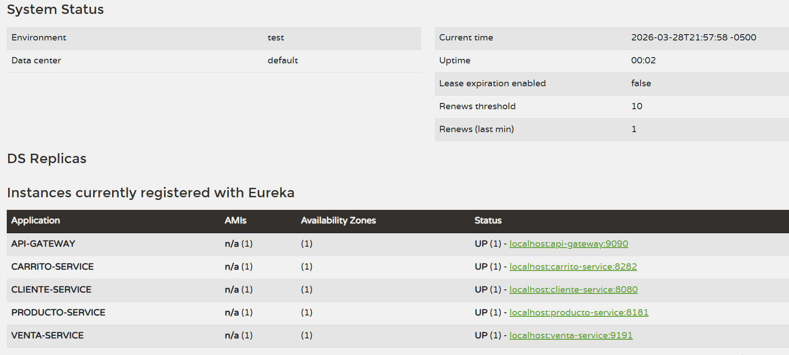

# 🧭 Eureka Server - ElectrodoStore

## 📌 Descripción
Servidor de registro y descubrimiento de servicios para el ecosistema de
microservicios de ElectrodoStore, basado en **Spring Cloud Netflix Eureka**.

Permite que los microservicios se registren automáticamente y se descubran
entre sí de forma dinámica, sin necesidad de conocer IPs o puertos fijos.

---

## ⚙️ Tecnologías utilizadas

- Java + Spring Boot
- Spring Cloud Netflix Eureka Server

---

## 🔄 ¿Cómo funciona?

Al iniciar, cada microservicio se registra en Eureka con su nombre de
aplicación. Cuando un servicio necesita comunicarse con otro, consulta
a Eureka para obtener la ubicación de la instancia disponible.
```
Microservicio A → Eureka Server → Microservicio B
```

Esto permite:
- Descubrimiento dinámico sin IPs hardcodeadas
- Detección automática de instancias caídas
- Soporte para múltiples instancias del mismo servicio

---

## ⚙️ Configuración destacada

| Propiedad | Valor | Descripción |
|---|---|---|
| `register-with-eureka` | `false` | El servidor no se registra a sí mismo |
| `fetch-registry` | `false` | No replica el registro de otros servidores |

---

## 🔌 Configuración de red

| Propiedad | Valor |
|---|---|
| Puerto | `8761` |
| Acceso | ✅ Expuesto — acceso al dashboard habilitado |
| Dashboard | `http://localhost:8761` |

---

## 📊 Dashboard

Eureka expone un dashboard web en `http://localhost:8761` donde se pueden
visualizar en tiempo real:

- Servicios registrados
- Estado de cada instancia
- Información de cada microservicio



---

## ▶️ Ejecución local

**Con Maven**
```bash
# Corre en el puerto 8761
mvn spring-boot:run
```

**Con Docker**
```bash
docker build -t eureka-server .
```

> ⚠️ Este servicio debe iniciarse **después del Config Server** y
> **antes que cualquier microservicio**, ya que todos dependen de él
> para el descubrimiento dinámico.

---

## 💡 Decisiones de diseño

- `register-with-eureka: false` — el servidor no actúa como cliente de sí mismo
- `fetch-registry: false` — configuración adecuada para instancia única sin replicación
- Puerto estándar de Eureka (`8761`) para facilitar integración con herramientas del ecosistema Spring

---

## 🚀 Mejoras futuras

- Alta disponibilidad con múltiples instancias de Eureka (Peer Awareness)
- Seguridad con autenticación básica en el dashboard
- Monitoreo con Spring Boot Actuator