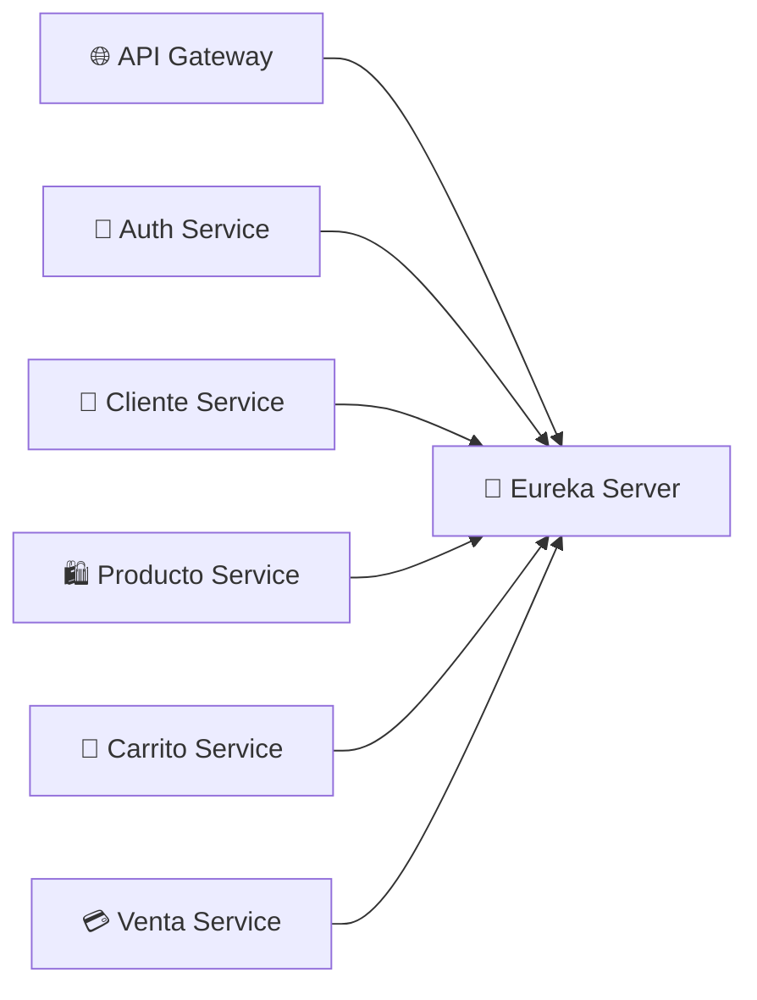
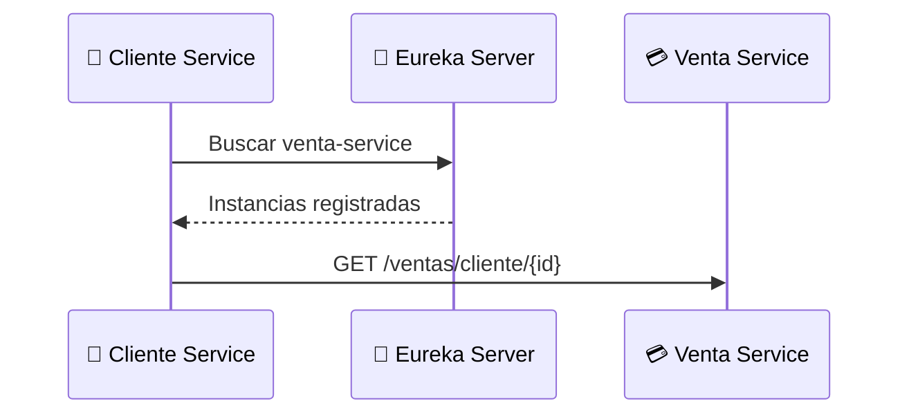
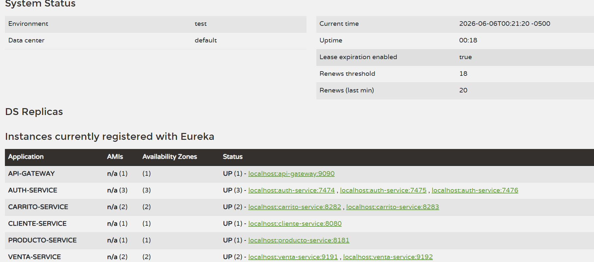

<div align="center">

# 🧭 Eureka Server

### Registro y descubrimiento de servicios
#### ElectrodoStore · Spring Cloud Netflix Eureka


</div>

---

Eureka Server actúa como el registro central de servicios dentro de **ElectrodoStore**.

Permite que los microservicios se registren automáticamente y descubran dinámicamente otras instancias disponibles sin depender de direcciones IP o puertos fijos.

---

## 🎯 Responsabilidades

- 📍 Registro de microservicios
- 🔍 Descubrimiento dinámico de servicios
- ⚖️ Soporte para balanceo de carga
- 🌐 Catálogo centralizado de instancias
- 🔗 Desacoplamiento entre consumidores y proveedores

---

## 🧰 Stack tecnológico


---

## 🌐 Ecosistema registrado


```mermaid
flowchart LR

Gateway["🌐 API Gateway"]
Auth["🔐 Auth Service"]
Cliente["👤 Cliente Service"]
Producto["🛍️ Producto Service"]
Carrito["🛒 Carrito Service"]
Venta["💳 Venta Service"]
Eureka["🧭 Eureka Server"]

Gateway --> Eureka
Auth --> Eureka
Cliente --> Eureka
Producto --> Eureka
Carrito --> Eureka
Venta --> Eureka
```

> Todos los servicios registran su ubicación en Eureka durante el arranque.

---

## 🔄 Descubrimiento de servicios

Cuando un servicio necesita comunicarse con otro, consulta Eureka para obtener las instancias disponibles, eliminando dependencias directas y permitiendo escalar horizontalmente.


```mermaid
sequenceDiagram

participant Cliente as 👤 Cliente Service
participant Eureka as 🧭 Eureka Server
participant Venta as 💳 Venta Service

Cliente->>Eureka: Buscar venta-service
Eureka-->>Cliente: Instancias registradas
Cliente->>Venta: GET /ventas/cliente/{id}
```

---

## ⚖️ Integración con Load Balancer

Los consumidores utilizan nombres lógicos de servicio, y Spring Cloud LoadBalancer consulta Eureka para seleccionar una instancia disponible.

<table>
<tr>
<th>Via YAML</th>
<th>Via OpenFeign</th>
</tr>
<tr>
<td>

```yaml
uri: lb://venta-service
```

</td>
<td>

```java
@FeignClient(name = "venta-service")
```

</td>
</tr>
</table>

---

## ⚙️ Configuración destacada

| Propiedad | Valor | Descripción |
| --- | --- | --- |
| `register-with-eureka` | `false` | Eureka no se registra a sí mismo |
| `fetch-registry` | `false` | No replica registros externos |

---

## 📊 Dashboard

Eureka expone un panel web para visualizar el estado del ecosistema en tiempo real:

- Servicios registrados y sus instancias
- Estado de salud de cada servicio
- Direcciones disponibles
- Información de descubrimiento



Eureka registrando múltiples instancias de Auth Service, Carrito Service y Venta Service para permitir descubrimiento dinámico y balanceo de carga mediante Spring Cloud LoadBalancer.

| Propiedad | Valor |
| --- | --- |
| Puerto | `8761` |
| Dashboard | `http://localhost:8761` |
| Acceso | ✅ Interno y administrativo |

---

## ▶️ Ejecución local

> ⚠️ Eureka Server debe iniciarse **después de Config Server** y **antes de cualquier microservicio** consumidor.

### Maven

```bash
mvn spring-boot:run
```

### Docker

```bash
docker build -t eureka-server .
```

---

## 🏗️ Arquitectura

- 🧭 Service Discovery mediante Eureka
- ⚖️ Integración con Spring Cloud LoadBalancer
- 🔗 Resolución dinámica de dependencias
- 🌐 Compatible con API Gateway y OpenFeign
- 📍 Registro automático de instancias

---

## 💡 Decisiones de diseño

<details>
<summary><b>📍 Descubrimiento dinámico</b></summary>
<br>
Los servicios se comunican utilizando nombres lógicos en lugar de direcciones físicas, reduciendo el acoplamiento entre componentes.
</details>

<details>
<summary><b>⚖️ Integración con LoadBalancer</b></summary>
<br>
Las instancias disponibles son seleccionadas automáticamente por Spring Cloud LoadBalancer utilizando la información registrada en Eureka.
</details>

<details>
<summary><b>🧭 Registro centralizado</b></summary>
<br>
Todos los microservicios comparten una única fuente de verdad para descubrir servicios dentro de la plataforma.
</details>

---

## 🚀 Mejoras futuras

| Mejora | Descripción |
| --- | --- |
| 🏢 **Alta disponibilidad** | Clúster Eureka con Peer Awareness |
| 🔐 **Seguridad** | Protección del dashboard administrativo |
| 📊 **Observabilidad** | Métricas y monitoreo avanzado |
| 🌎 **Multi-región** | Descubrimiento distribuido entre regiones |
| ⚡ **Escalabilidad** | Replicación de registros entre nodos |
